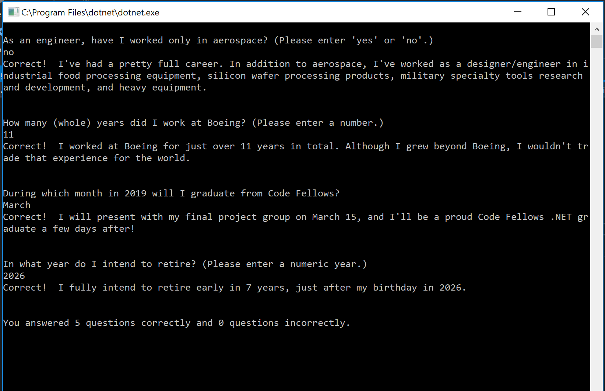
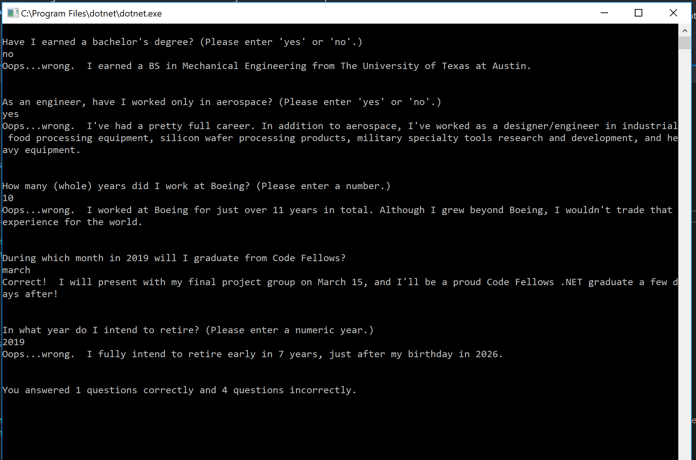
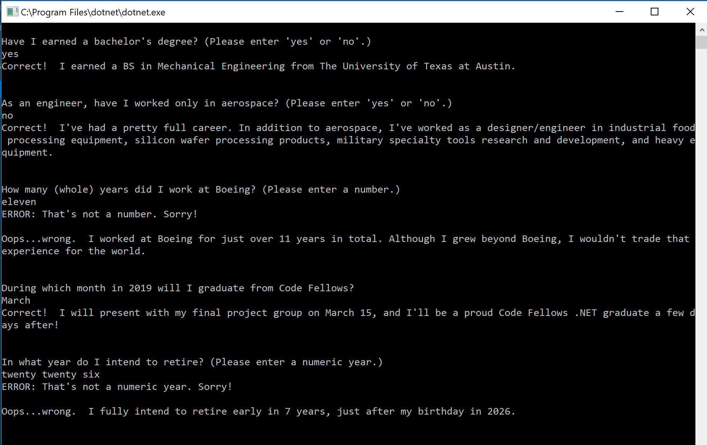

## Lab01-AboutMe ##

# What is the purpose of the program?
This program is a Console-based quiz. When run, it asks a series of questions, pausing after each to receive responses from the user, and giving feedback to the user after each response.

# How do I run the program?
This is a Console-based program. To run in Visual Studio 2017, load the project (AboutMe/AboutMe.csproj), open the code file (AboutMe/Project.cs), and press Ctrl+F5 to compile and run without debug. The quiz will automatically run in a new terminal window.

# What does the program look like? (visual)
The program will display questions and feedback on answers, which includes:
 - error message if incorrect type entered for numbers
 - assessment of correct or incorrect
 - more details relevant to the question
 - total tally of correct and incorrect answers

See it in action...
When all questions are answered correctly:

When most are answered incorrectly, but all responses are of valid type:

When all are answered correctly, but there are some type exceptions caught:

